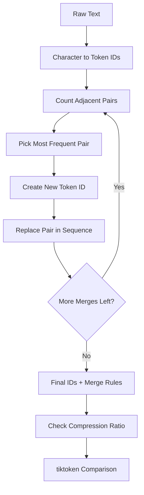

1. Take one sentence and split it into words.
2. Split the same sentence into characters and see there are many more tokens.
3. Add a big text paragraph as training text.
4. Convert each character to a number (token id).
5. Copy the token list so the original list is safe.
6. Count how many times each neighboring token pair appears.
7. Pick the pair that appears the most.
8. Give a new token id for that pair.
9. Replace all places of that pair with the new token id.
10. Repeat count, pick, and replace for many rounds (20 rounds in this notebook).
11. Save the merge rules in a dictionary.
12. Compare old token length vs new token length and print compression ratio.
13. Use tiktoken library.
14. Encode and decode one sample sentence with GPT-2 tokenizer.
15. Encode and decode the same sentence with GPT-3.5 tokenizer.
16. Encode and decode the same sentence with GPT-4 tokenizer.
17. Compare token ids and token pieces from all models.

## Visual Flow (Simple)

## One Merge Example

Before merge:

- IDs: [65, 66, 65, 66, 67]
- Pair (65, 66) appears 2 times

Create new token ID:

- New ID: 128

After merge:

- IDs: [128, 128, 67]

This is how sequence length gets smaller after repeated merges.

## Tiny Tokenization View

| Model | Example Text | Output Type |
|---|---|---|
| GPT-2 | The lion roams in the jungle | token ids + token pieces |
| GPT-3.5 | The lion roams in the jungle | token ids + token pieces |
| GPT-4 | The lion roams in the jungle | token ids + token pieces |

This helps us see that different model encodings can split text differently.
